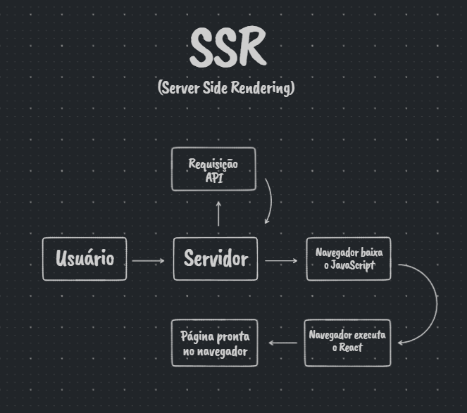
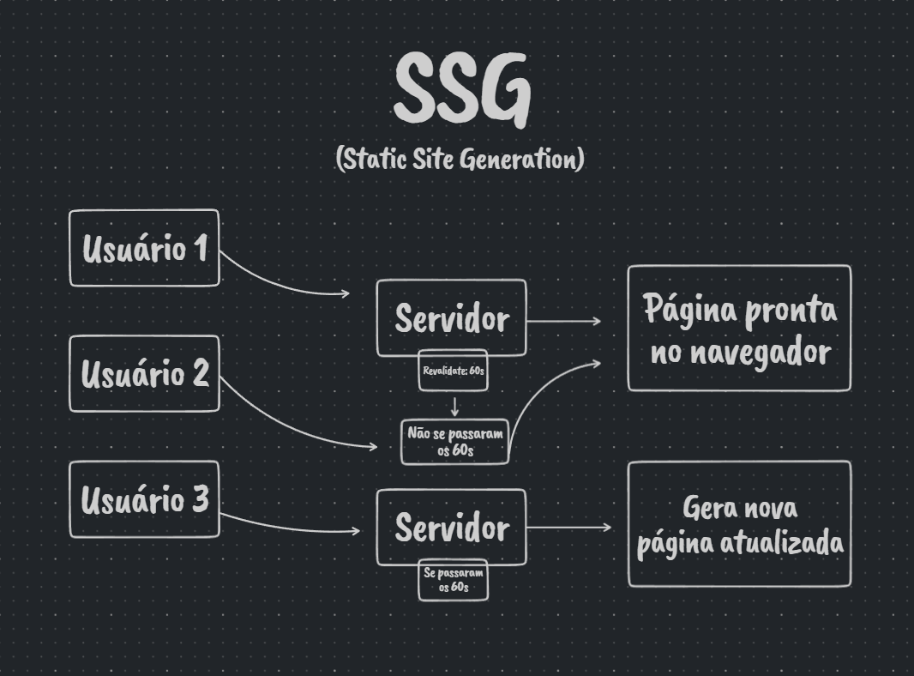

<div align="center">
<h1 align="center">➕Taskify+.<br> Next.js App</h1>
</div>

<p align="center">
  <a href="#-Tecnologies">Technologies</a>&nbsp;&nbsp;&nbsp;|&nbsp;&nbsp;&nbsp;
  <a href="#-project">Project</a>&nbsp;&nbsp;&nbsp;|&nbsp;&nbsp;&nbsp;
  <a href="#-license">License</a>
</p>

<p align="center">
 
  
  
</p>

<p align="center">
    
</p>

<br>

<p align="center">
  
</p>

# 📄 Description:

### What is this project? 📝

- This Web App allows you to create tasks and share with your team or study groups and they can insert comments. 


- Next.js was chosen for this project because it has features that I thought were essential for the performance of this application, SSR (Server Side Rendering) and SSG (Site Static Generation). Below is a schematic explaining these concepts:

<h2 align="center"><a href="#SSR.txt">Server Side Rendering</a></h2>
<p align="center">
  
</p>

<h2 align="center"><a href="#SSG.txt">Static Site Generation</a></h2>
<p align="center">
  
</p>

&nbsp;
&nbsp;
# 🚀 Technologies:

This project was developed with the following technologies:

### ReactJS 📝

### Next.js 📝

### TypeScript 📝

### NextAuth 📝

### Firebase 📝

### Oauth2 📝

### Module-pattern 📝

### react-toastify 📝


How to run:

```bash

# Clone Repository

$ git clone

# Go to folder

$ cd taskify

# Install Dependencies

$ yarn

# Run Aplication

$ yarn dev

```

# 🚧 Project:

### [Live project!]() 🚀

# 📝 License:

This project is under the MIT license. See the [LICENSE](LICENSE) for more information.

<hr>